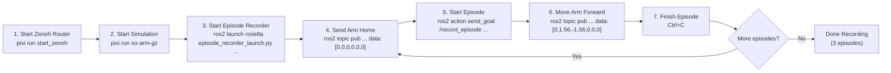

# Pick and Place with SO-ARM100, LeRobot and Rosetta

This guide covers the full workflow for data collection, training, and deployment using [Rosetta](https://github.com/iblnkn/rosetta) and [LeRobot v0.4.3](https://github.com/huggingface/lerobot).

Rosetta bridges ROS 2 and LeRobot by defining a **contract** that maps ROS 2 topics to LeRobot features. This replaces the need for custom recording/replay scripts and provides a standardized pipeline.

```
  ┌──────────┐     ┌──────────┐     ┌──────────┐     ┌──────────┐     ┌──────────┐
  │  DEFINE  │     │  RECORD  │     │ CONVERT  │     │  TRAIN   │     │  DEPLOY  │
  │ Contract │────▶│  Demos   │────▶│ Dataset  │────▶│  Policy  │────▶│ on Robot │
  └──────────┘     └──────────┘     └──────────┘     └──────────┘     └──────────┘
```

## Prerequisites

Follow the [Development Guide](./DEVELOPMENT.md) to set up the workspace with [Pixi](https://pixi.sh/).

```bash
# Fetch external repos (rosetta, rosetta_interfaces)
vcs import external < pai.repos --recursive

# Install base environment (includes ROS 2 Kilted dependencies)
pixi install

# Install ML dependencies (auto-detects GPU, installs PyTorch + lerobot==0.4.3)
pixi run install-ml-deps

# Build the workspace
pixi run build
```

> [!NOTE]
> All commands below assume you are inside a `pixi shell` session or running via `pixi run`.

---

## The Contract

The SO-ARM101 contract is defined at `pai_data_collection/config/rosetta/so_arm101.yaml` and maps the robot's ROS 2 topics to LeRobot features:

| ROS 2 Side | | LeRobot Side |
|------------|---|-------------|
| `/camera` (`sensor_msgs/Image`) | → | `observation.images.wrist` |
| `/joint_states` (`sensor_msgs/JointState`) | → | `observation.state` |
| `/forward_position_controller/commands` (`Float64MultiArray`) | ← | `action` |

Key contract features:
- **FPS**: 50 Hz (matches controller update rate)
- **Image resize**: 480×480 for neural network input
- **Unit conversion**: `rad2deg` — automatically converts ROS 2 radians to LeRobot degrees
- **Safety behavior**: `hold` — maintains last position when stopped

---

## Recording Episodes

### 1. Start Zenoh Router

```bash
pixi run start_zenoh
```

### 2. Start Simulation (or real robot)

```bash
pixi run so-arm-gz
```

### 3. Start the Episode Recorder

```bash
ros2 launch rosetta episode_recorder_launch.py \
    contract_path:=$(ros2 pkg prefix pai_data_collection)/share/pai_data_collection/config/rosetta/so_arm101.yaml \
    bag_base_dir:=datasets/so_arm101/bags
```

### 4. Send the Arm Home

Before each episode, send the arm to the home position (all joints at zero):

```bash
ros2 topic pub /forward_position_controller/commands std_msgs/msg/Float64MultiArray \
  '{layout: {dim: [{label: joint, size: 6, stride: 1}]}, data: [0.0, 0.0, 0.0, 0.0, 0.0, 0.0]}' --rate 20
```

Hold for a few seconds, then stop with `Ctrl+C`.

### 5. Start an Episode

```bash
ros2 action send_goal /record_episode \
    rosetta_interfaces/action/RecordEpisode "{prompt: 'move arm forward'}" --feedback
```

### 6. Move the Arm Forward

> [!NOTE]
> We use a simple fixed-position command here for the sake of the demo. In practice, you can perform any complex manipulation task — teleoperation, multi-step pick-and-place, etc.

Command the arm to reach forward:

```bash
ros2 topic pub /forward_position_controller/commands std_msgs/msg/Float64MultiArray \
  '{layout: {dim: [{label: joint, size: 6, stride: 1}]}, data: [0.0, 1.56, -1.56, 0.0, 0.0, 0.0]}' --rate 20
```

Hold for a few seconds, then stop with `Ctrl+C`.

### 7. Finish Episode

Cancel the action goal (`Ctrl+C` in the terminal where `send_goal` was run). This saves a rosbag for that episode.

### 8. Record More Episodes

Repeat steps 4–7 to record **3 episodes** of the move-arm-forward demonstration.

### Workflow Overview



---

## Convert Rosbag to LeRobot Dataset

The contract's `unit_conversion: rad2deg` automatically converts ROS 2 radians to LeRobot degrees during conversion.

```bash
python -m rosetta.port_bags \
    --raw-dir datasets/so_arm101/bags \
    --contract $(ros2 pkg prefix pai_data_collection)/share/pai_data_collection/config/rosetta/so_arm101.yaml \
    --repo-id move_arm \
    --root datasets_lerobot
```

### port_bags Arguments

| Argument | Required | Description |
|----------|----------|-------------|
| `--raw-dir` | Yes | Directory containing bag subdirectories (each with `metadata.yaml`) |
| `--contract` | Yes | Path to rosetta contract YAML |
| `--repo-id` | No | Dataset name. Defaults to `--raw-dir` directory name |
| `--root` | No | Parent directory for datasets. Dataset saved to `root/repo-id` |
| `--push-to-hub` | No | Upload to HuggingFace Hub after conversion |
| `--vcodec` | No | Video codec (default: `libsvtav1`). Use `libx264` for faster encoding |

---

## Replay Dataset

### Replay on Real Robot via LeRobot

Using a local LeRobot dataset with `lerobot-replay`:

```bash
lerobot-replay \
    --robot.type=so101_follower \
    --robot.port=/dev/ttyACM0 \
    --robot.id=my_awesome_arm \
    --dataset.repo_id=move_arm \
    --dataset.root=datasets_lerobot/move_arm \
    --dataset.episode=0 \
    --robot.use_degrees=true \
    --play_sounds=false
```

**Important flags:**
- `--robot.use_degrees=true` — required because the dataset contains degree values (from `unit_conversion: rad2deg` in the contract)
- `--play_sounds=false` — disables audio feedback (avoids `spd-say` errors)

### Replay Dataset via ROS 2 (Simulation or Real)

To replay a dataset through the ROS 2 control stack (e.g., Gazebo sim), use the `rosetta` robot type instead of a hardware-specific driver. This is provided by the [`lerobot_robot_rosetta`](https://github.com/iblnkn/lerobot-robot-rosetta) plugin, which implements LeRobot's `Robot` interface backed by Rosetta's contract. It subscribes to observation topics and publishes actions to the contract's ROS 2 topics:

```bash
lerobot-replay \
    --robot.type=rosetta \
    --robot.config_path=$(ros2 pkg prefix pai_data_collection)/share/pai_data_collection/config/rosetta/so_arm101.yaml \
    --dataset.repo_id=move_arm \
    --dataset.root=datasets_lerobot/move_arm \
    --dataset.episode=0
```

This works with any ROS 2 backend (Gazebo, MuJoCo, or real hardware) as long as the controllers are running and listening on the topics defined in the contract. Unit conversion (`rad2deg` ↔ `deg2rad`) is handled automatically by the contract.

---

## Train a Policy

### ACT Policy

```bash
lerobot-train \
    --dataset.repo_id=move_arm \
    --dataset.root=datasets_lerobot/move_arm \
    --policy.type=act \
    --output_dir=outputs/train/act_move_arm \
    --job_name=act_move_arm \
    --policy.device=cuda \
    --policy.push_to_hub=false \
    --wandb.enable=false \
    --steps=3000 \
    --batch_size=32 \
    --save_freq=1500 \
    --log_freq=500
```


### Resume Training

```bash
lerobot-train \
    --config_path=outputs/train/act_move_arm/checkpoints/last/pretrained_model/train_config.json \
    --resume=true
```

### Supported Policies

| Policy | Type | Best For |
|--------|------|----------|
| **ACT** | Behavior Cloning | General manipulation, fast training (recommended for beginners) |
| **SmolVLA** | VLA | Efficient VLA, good for resource-constrained setups |
| **Pi0** / **Pi0Fast** | VLA | Physical Intelligence foundation models |
| **Diffusion** | Diffusion Policy | Tasks requiring multimodal action distributions |

---

## Deploy Policy (Inference)

### Using Rosetta Client Node

The `rosetta_client_node` wraps LeRobot's inference pipeline in ROS 2 actions and handles unit conversion via the contract automatically.

**Terminal 1** — Start Zenoh:
```bash
pixi run start_zenoh
```

**Terminal 2** — Start simulation (or real robot):
```bash
pixi run so-arm-gz
```

**Terminal 3** — Launch the Rosetta client:
```bash
ros2 launch rosetta rosetta_client_launch.py \
    contract_path:=$(ros2 pkg prefix pai_data_collection)/share/pai_data_collection/config/rosetta/so_arm101.yaml \
    pretrained_name_or_path:=outputs/train/act_move_arm/checkpoints/last/pretrained_model \
    policy_type:=act \
    policy_device:=cuda
```

**Terminal 4** — Run the policy:
```bash
ros2 action send_goal /run_policy \
    rosetta_interfaces/action/RunPolicy "{prompt: 'move arm'}"
```

#### Rosetta Client Parameters

| Parameter | Default | Description |
|-----------|---------|-------------|
| `contract_path` | — | Path to contract YAML |
| `pretrained_name_or_path` | — | HuggingFace model ID or local path |
| `policy_type` | `act` | Policy type: `act`, `smolvla`, `diffusion`, `pi0`, etc. |
| `policy_device` | `cuda` | Inference device: `cuda`, `cpu` |
| `server_address` | `127.0.0.1:8080` | Policy server address (for remote inference) |
| `actions_per_chunk` | `30` | Actions per inference chunk |
| `launch_local_server` | `true` | Launch local gRPC policy server or connect to remote |
