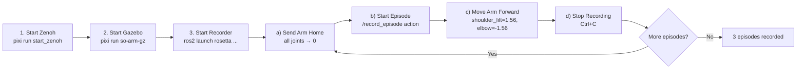

# End-to-End Learning Pipeline with Rosetta

This guide explains the full Record → Train → Deploy pipeline using [Rosetta](https://github.com/iblnkn/rosetta) and [LeRobot](https://github.com/huggingface/lerobot). Rosetta bridges ROS 2 and LeRobot by defining a **contract** that maps ROS 2 topics to LeRobot features — replacing custom recording and replay scripts with a standardized, task-agnostic pipeline.

```
  ┌──────────┐     ┌──────────┐     ┌──────────┐     ┌──────────┐     ┌──────────┐
  │  DEFINE  │     │  RECORD  │     │ CONVERT  │     │  TRAIN   │     │  DEPLOY  │
  │ Contract │────▶│  Demos   │────▶│ Dataset  │────▶│  Policy  │────▶│ on Robot │
  └──────────┘     └──────────┘     └──────────┘     └──────────┘     └──────────┘
```

The pipeline is **not tied to a specific task**. The same workflow applies whether you are teaching the robot to pick and place objects, sort items, wave, or perform any other manipulation behavior — only the recorded demonstrations define what the policy learns.

## Prerequisites

Follow the main [README](../../README.md) to set up the workspace:

```bash
git clone https://github.com/ros-physical-ai/demos && cd demos
vcs import external < pai.repos --recursive
pixi install
pixi run install-ml-deps   # PyTorch + LeRobot (auto-detects GPU)
pixi run build
```

> [!NOTE]
> All commands below assume you are inside a `pixi shell` session or running via `pixi run`.

---

## Your Options

The repo is designed to be flexible — you can mix and match backends, input methods, and policies depending on your setup and goals:

| Dimension         | Options                                                                                                                                        |
| ----------------- | ---------------------------------------------------------------------------------------------------------------------------------------------- |
| **Robot backend** | **Gazebo** (`pixi run so-arm-gz`), **MuJoCo** (`pixi run so-arm-mujoco`), or **Real hardware** (`pixi run so-arm-real`)                        |
| **Input method**  | **Leader arm teleoperation** (`pixi run so-arm-leader`), scripted `ros2 topic pub` commands, or any custom node publishing to the action topic |
| **Policy type**   | **ACT** (behavior cloning), **SmolVLA** / **Pi0** / **Pi0Fast** (VLAs), **Diffusion** (diffusion policy) — any LeRobot-supported policy        |
| **Application**   | Any manipulation task — pick-and-place, sorting, assembly, pouring, etc. The pipeline is task-agnostic                                         |

All backends publish the **same ROS 2 topics** (`/joint_states`, `/forward_position_controller/commands`, camera image topics), so the Rosetta contract works identically regardless of whether you run in Gazebo, MuJoCo, or on real hardware. You can prototype a task in simulation and later collect real-world demonstrations (or vice versa) without changing the pipeline.

> [!TIP]
> **Leader arm teleoperation** is the recommended input method for real-world data collection. A second physical SO-ARM101 acts as a torque-free leader — you move it by hand, and the follower arm mirrors the motion in real time. Because the leader teleop node publishes to `/forward_position_controller/commands` (the same topic the contract records), the episode recorder captures human demonstrations transparently.

---

## The Pipeline

### 1. The Contract

A Rosetta contract is a YAML file that defines the mapping between ROS 2 topics and LeRobot dataset features. It tells Rosetta what to record, how to convert units, and where to publish actions during inference.

The SO-ARM101 contract lives at `pai_data_collection/config/rosetta/so_arm101.yaml`:

| ROS 2 Side                                                    |     | LeRobot Side                |
| ------------------------------------------------------------- | --- | --------------------------- |
| `/wrist_camera/image_raw` (`sensor_msgs/Image`)               | →   | `observation.images.wrist`  |
| `/static_camera/image_raw` (`sensor_msgs/Image`)              | →   | `observation.images.static` |
| `/joint_states` (`sensor_msgs/JointState`)                    | →   | `observation.state`         |
| `/forward_position_controller/commands` (`Float64MultiArray`) | ←   | `action`                    |

Key contract features:

- **FPS**: 50 Hz (matches the `ros2_control` update rate)
- **Image resize**: 480×480 for neural network input
- **Unit conversion**: `rad2deg` — automatically converts ROS 2 radians to LeRobot degrees during recording and back during inference
- **Safety behavior**: `hold` — maintains last commanded position when inference stops

You can inspect or modify the contract to fit your robot or sensor configuration. For example, you could add more cameras, change the FPS, or adjust image resolution.

### 2. Recording Episodes

Recording captures rosbags of demonstration episodes through the Rosetta episode recorder. The general flow is:

1. **Start the Zenoh router** — required middleware for ROS 2 communication.
2. **Start the robot** — simulation or real hardware.
3. **Start the episode recorder** — points to the contract and an output directory for bags.
4. **For each episode:**
   a. Reset the robot to a starting pose.
   b. Trigger recording via the `/record_episode` ROS 2 action (the `prompt` field is metadata stored with the episode).
   c. Perform the task — via leader teleop, scripted commands, or any other method.
   d. Stop recording (`Ctrl+C` on the action goal) to save the rosbag.
5. **Repeat** to collect as many episodes as needed.

The commands:

```bash
# Start the episode recorder (works with any backend)
ros2 launch rosetta episode_recorder_launch.py \
    contract_path:=$(ros2 pkg prefix pai_data_collection)/share/pai_data_collection/config/rosetta/so_arm101.yaml \
    bag_base_dir:=<output_directory>

# Trigger an episode
ros2 action send_goal /record_episode \
    rosetta_interfaces/action/RecordEpisode "{prompt: '<task description>'}" --feedback
```

> [!NOTE]
> The input method doesn't matter to the recorder — anything that publishes to the topics defined in the contract gets captured. Leader arm teleop, scripted commands, MoveIt planning, or a custom controller all work the same way.

#### Verifying a Recorded Episode

After recording, you can replay a rosbag to confirm it was captured correctly before converting or training. This plays back the recorded topics so you can visualize them in RViz or on the robot itself:

```bash
ros2 bag play <path_to_bag_directory>
```

For example, to replay at the original recording rate and inspect topics:

```bash
# List the topics in the bag
ros2 bag info <path_to_bag_directory>

# Play back the bag (robot + cameras will replay)
ros2 bag play <path_to_bag_directory>
```

> [!TIP]
> If the robot backend (Gazebo, MuJoCo, or real hardware) is running, replaying the bag will send the recorded commands to the robot, making it reproduce the demonstration. This is a quick way to spot bad episodes — look for jerky motions, missed grasps, or incorrect camera framing.

### 3. Converting to LeRobot Dataset

After recording, convert the rosbags into a LeRobot dataset using `rosetta.port_bags`. The contract's `unit_conversion: rad2deg` is applied automatically during conversion.

```bash
python -m rosetta.port_bags \
    --raw-dir <path_to_bags> \
    --contract $(ros2 pkg prefix pai_data_collection)/share/pai_data_collection/config/rosetta/so_arm101.yaml \
    --repo-id <dataset_name> \
    --root <datasets_directory>
```

#### port_bags Arguments

| Argument        | Required | Description                                                           |
| --------------- | -------- | --------------------------------------------------------------------- |
| `--raw-dir`     | Yes      | Directory containing bag subdirectories (each with `metadata.yaml`)   |
| `--contract`    | Yes      | Path to Rosetta contract YAML                                         |
| `--repo-id`     | No       | Dataset name. Defaults to the `--raw-dir` directory name              |
| `--root`        | No       | Parent directory for datasets. Dataset saved to `root/repo-id`        |
| `--push-to-hub` | No       | Upload to HuggingFace Hub after conversion                            |
| `--vcodec`      | No       | Video codec (default: `libsvtav1`). Use `libx264` for faster encoding |

### 4. Training a Policy

Train any LeRobot-supported policy on the converted dataset:

```bash
lerobot-train \
    --dataset.repo_id=<dataset_name> \
    --dataset.root=<datasets_directory>/<dataset_name> \
    --policy.type=<policy_type> \
    --output_dir=outputs/train/<run_name> \
    --job_name=<run_name> \
    --policy.device=cuda
```

To resume from a checkpoint:

```bash
lerobot-train \
    --config_path=outputs/train/<run_name>/checkpoints/last/pretrained_model/train_config.json \
    --resume=true
```

#### Supported Policies

| Policy                | Type             | Best For                                                        |
| --------------------- | ---------------- | --------------------------------------------------------------- |
| **ACT**               | Behavior Cloning | General manipulation, fast training (recommended for beginners) |
| **SmolVLA**           | VLA              | Efficient VLA, good for resource-constrained setups             |
| **Pi0** / **Pi0Fast** | VLA              | Physical Intelligence foundation models                         |
| **Diffusion**         | Diffusion Policy | Tasks requiring multimodal action distributions                 |

### 5. Replaying a Dataset (Optional Verification)

Before training, you can replay recorded episodes to visually verify data quality.

#### Replay via ROS 2 (Simulation or Real)

Uses the [`lerobot_robot_rosetta`](https://github.com/iblnkn/lerobot-robot-rosetta) plugin to replay actions through the ROS 2 control stack. This works with any backend (Gazebo, MuJoCo, or real hardware):

```bash
lerobot-replay \
    --robot.type=rosetta \
    --robot.config_path=$(ros2 pkg prefix pai_data_collection)/share/pai_data_collection/config/rosetta/so_arm101.yaml \
    --dataset.repo_id=<dataset_name> \
    --dataset.root=<datasets_directory>/<dataset_name> \
    --dataset.episode=0
```

Unit conversion (`rad2deg` ↔ `deg2rad`) is handled automatically by the contract.

#### Replay Directly on Real Hardware via LeRobot

For replaying directly on a physical robot without the ROS 2 control stack:

```bash
lerobot-replay \
    --robot.type=so101_follower \
    --robot.port=/dev/ttyACM0 \
    --robot.id=my_awesome_arm \
    --dataset.repo_id=<dataset_name> \
    --dataset.root=<datasets_directory>/<dataset_name> \
    --dataset.episode=0 \
    --robot.use_degrees=true \
    --play_sounds=false
```

- `--robot.use_degrees=true` — required because the dataset contains degree values (from `unit_conversion: rad2deg` in the contract)
- `--play_sounds=false` — disables audio feedback (avoids `spd-say` errors)

### 6. Deploying a Policy

The `rosetta_client_node` wraps LeRobot's inference pipeline in a ROS 2 action server. It loads the trained policy, subscribes to observation topics, and publishes actions — all following the contract. Unit conversion is handled automatically.

```bash
# Launch the Rosetta client
ros2 launch rosetta rosetta_client_launch.py \
    contract_path:=$(ros2 pkg prefix pai_data_collection)/share/pai_data_collection/config/rosetta/so_arm101.yaml \
    pretrained_name_or_path:=<path_to_checkpoint> \
    policy_type:=<policy_type> \
    policy_device:=cuda

# Trigger inference
ros2 action send_goal /run_policy \
    rosetta_interfaces/action/RunPolicy "{prompt: '<task description>'}"
```

Because the contract defines the topic interface, the same deployment command works whether the robot backend is Gazebo, MuJoCo, or real hardware.

#### Rosetta Client Parameters

| Parameter                 | Default          | Description                                             |
| ------------------------- | ---------------- | ------------------------------------------------------- |
| `contract_path`           | —                | Path to contract YAML                                   |
| `pretrained_name_or_path` | —                | HuggingFace model ID or local path to checkpoint        |
| `policy_type`             | `act`            | Policy type: `act`, `smolvla`, `diffusion`, `pi0`, etc. |
| `policy_device`           | `cuda`           | Inference device: `cuda`, `cpu`                         |
| `server_address`          | `127.0.0.1:8080` | Policy server address (for remote inference)            |
| `actions_per_chunk`       | `30`             | Actions per inference chunk                             |
| `launch_local_server`     | `true`           | Launch local gRPC policy server or connect to remote    |

---

## Walkthrough: Train a Simple Policy in Simulation

This section walks through the entire pipeline end-to-end using **Gazebo** and **ACT**. We train the robot to perform a simple "move arm forward" motion using scripted commands. In practice, you would replace the scripted commands with leader arm teleoperation or another input method and record a real manipulation task.

### Step 1 — Start the Zenoh Router

```bash
pixi run start_zenoh
```

### Step 2 — Start Gazebo Simulation

```bash
pixi run so-arm-gz
```

> [!TIP]
> You can substitute this with `pixi run so-arm-mujoco` (MuJoCo) or `pixi run so-arm-real` (real hardware). The rest of the commands remain the same.

### Step 3 — Start the Episode Recorder

```bash
ros2 launch rosetta episode_recorder_launch.py \
    contract_path:=$(ros2 pkg prefix pai_data_collection)/share/pai_data_collection/config/rosetta/so_arm101.yaml \
    bag_base_dir:=datasets/so_arm101/bags
```

### Step 4 — Record 3 Episodes

For each episode, repeat the following cycle:

**a) Send the arm home** (all joints at zero):

```bash
ros2 topic pub /forward_position_controller/commands std_msgs/msg/Float64MultiArray \
  '{layout: {dim: [{label: joint, size: 6, stride: 1}]}, data: [0.0, 0.0, 0.0, 0.0, 0.0, 0.0]}' --rate 20
```

Hold for a few seconds, then `Ctrl+C`.

**b) Start recording an episode:**

```bash
ros2 action send_goal /record_episode \
    rosetta_interfaces/action/RecordEpisode "{prompt: 'move arm forward'}" --feedback
```

**c) Perform the task** — command the arm to reach forward:

```bash
ros2 topic pub /forward_position_controller/commands std_msgs/msg/Float64MultiArray \
  '{layout: {dim: [{label: joint, size: 6, stride: 1}]}, data: [0.0, 1.56, -1.56, 0.0, 0.0, 0.0]}' --rate 20
```

Hold for a few seconds, then `Ctrl+C`.

**d) Stop recording** — `Ctrl+C` in the terminal where `send_goal` is running. This saves the rosbag.

Repeat (a)–(d) **3 times**.



### Step 4b (Optional) — Verify a Recorded Episode

Replay one of the recorded bags to confirm it looks correct. With Gazebo still running, the robot will reproduce the demonstration:

```bash
ros2 bag play datasets/so_arm101/bags/<episode_directory>
```

Watch the robot — it should reproduce the forward motion. If anything looks off (jerky motion, missing data), re-record that episode.

### Step 5 — Convert to LeRobot Dataset

```bash
python -m rosetta.port_bags \
    --raw-dir datasets/so_arm101/bags \
    --contract $(ros2 pkg prefix pai_data_collection)/share/pai_data_collection/config/rosetta/so_arm101.yaml \
    --repo-id move_arm \
    --root datasets_lerobot
```

### Step 6 — Train ACT Policy

```bash
lerobot-train \
    --dataset.repo_id=move_arm \
    --dataset.root=datasets_lerobot/move_arm \
    --policy.type=act \
    --output_dir=outputs/train/act_move_arm \
    --job_name=act_move_arm \
    --policy.device=cuda \
    --policy.push_to_hub=false \
    --wandb.enable=false \
    --steps=3000 \
    --batch_size=32 \
    --save_freq=1500 \
    --log_freq=500
```

### Step 7 — Deploy

**Terminal 3** — Launch the Rosetta client:

```bash
ros2 launch rosetta rosetta_client_launch.py \
    contract_path:=$(ros2 pkg prefix pai_data_collection)/share/pai_data_collection/config/rosetta/so_arm101.yaml \
    pretrained_name_or_path:=outputs/train/act_move_arm/checkpoints/last/pretrained_model \
    policy_type:=act \
    policy_device:=cuda
```

**Terminal 4** — Run the policy:

```bash
ros2 action send_goal /run_policy \
    rosetta_interfaces/action/RunPolicy "{prompt: 'move arm forward'}"
```

The arm should reproduce the forward motion it learned from the demonstrations.

### Next Steps

This walkthrough used a trivial scripted task to demonstrate the pipeline mechanics. To train a useful policy:

- **Use leader arm teleoperation** (`pixi run so-arm-leader`) to record human demonstrations of a real task — pick-and-place, sorting, stacking, etc.
- **Record more episodes** — real-world policies typically need dozens to hundreds of demonstrations.
- **Try different policies** — swap `--policy.type=act` for `smolvla`, `diffusion`, `pi0`, or `pi0fast` depending on your task complexity and available compute.
- **Move to real hardware** — swap `pixi run so-arm-gz` for `pixi run so-arm-real` and record real-world demonstrations. The pipeline commands stay the same.
