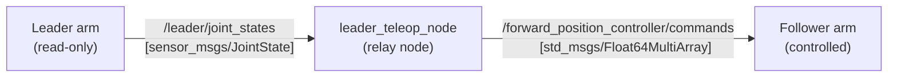

# pai_leader_teleop

Leader-follower teleoperation for the SO-ARM101 using `ros2_control`.

A human moves the **leader** arm by hand (torque disabled) while the **follower** arm mirrors the motion in real time via position commands.

## Architecture



- **Leader arm** – launched with state-only interfaces (no `<command_interface>` in the ros2_control xacro). The `feetech_ros2_driver` automatically disables torque on joints without command interfaces, so the arm is freely movable by hand while still reporting positions via `joint_state_broadcaster`.
- **Teleop relay node** – subscribes to the leader's joint states and publishes ordered position commands to the follower's `forward_position_controller`.
- **Follower arm** – uses the standard `pai_bringup` launch.

All leader nodes run under the `/leader` namespace to avoid topic and controller manager collisions with the follower.

## Calibration

Both the leader and follower arms must be calibrated before use. The calibration procedure writes `homing_offset` values to each servo's EEPROM so that joint positions are reported correctly.

See the [SO-ARM101 Calibration Guide](../docs/calibration_guide.md) for the full procedure, including:

- **Step 1** — Running `lerobot-calibrate` for the leader arm. This writes `homing_offset` to each servo's EEPROM and is **sufficient for normal use** — no additional config file is needed.
- **Step 2** *(optional)* — Providing a `joint_config_file` with per-robot overrides (homing offsets, range limits, PID gains, etc.) only if you want to version calibration in the repo or override specific driver parameters.

> [!NOTE]
> Even though the leader arm has no command interfaces (torque is disabled), running LeRobot calibration (Step 1) is still important. The driver uses `homing_offset` to convert raw encoder ticks to radians when *reading* positions. Without it, the joint positions forwarded to the follower may be incorrect.

To optionally use a calibration file with the leader:

```bash
ros2 launch pai_leader_teleop leader_bringup.launch.py \
    usb_port:=/dev/ttyACM1 \
    joint_config_file:=$(ros2 pkg prefix pai_bringup)/share/pai_bringup/config/hardware/leader.yaml
```

See [`pai_bringup/config/hardware/leader.yaml`](../pai_bringup/config/hardware/leader.yaml) for an example calibration file.

## Usage

Two terminals are needed:

```bash
# 1. Follower arm bringup (existing pai_bringup, default namespace)
ros2 launch pai_bringup so_arm_real_bringup.launch.py usb_port:=/dev/ttyACM0

# 2. Leader arm bringup + teleop relay
ros2 launch pai_leader_teleop leader_bringup.launch.py usb_port:=/dev/ttyACM1
```

## Launch arguments

### `leader_bringup.launch.py`

| Argument | Default | Description |
|---|---|---|
| `usb_port` | `/dev/ttyACM1` | USB port for the leader arm servo bus |
| `namespace` | `leader` | ROS namespace for leader nodes |
| `use_sim_time` | `false` | Use simulation time (set to `true` when the follower is simulated) |
| `prefix` | `""` | Joint name prefix |
| `joint_config_file` | `""` | Path to per-robot joint calibration YAML (homing offsets, PID gains, etc.). See [Calibration](#calibration) |
| `description_file` | `pai_leader_teleop/.../so_arm_leader.urdf.xacro` | URDF xacro file |
| `ros2_control_file` | `pai_leader_teleop/.../so_arm101_leader.ros2_control.xacro` | Leader ros2_control xacro (state-only) |
| `controllers_file` | `pai_leader_teleop/.../ros2_controllers_leader.yaml` | Leader controllers config |
| `follower_commands_topic` | `/forward_position_controller/commands` | Follower position controller command topic |
| `launch_rviz` | `false` | Launch RViz to visualize the leader arm |
| `rviz_config_file` | `pai_leader_teleop/.../so_arm_leader.rviz` | RViz config file for the leader arm |

## Visualizing the leader in RViz

To launch RViz alongside the leader arm for real-time visualization, pass `launch_rviz:=true`:

```bash
ros2 launch pai_leader_teleop leader_bringup.launch.py usb_port:=/dev/ttyACM1 launch_rviz:=true
```

RViz is automatically configured to use the leader's namespaced TF topics (`/leader/tf`, `/leader/tf_static`), so it displays the leader model without interfering with the follower's visualization.

To use a custom RViz config file:

```bash
ros2 launch pai_leader_teleop leader_bringup.launch.py usb_port:=/dev/ttyACM1 launch_rviz:=true \
    rviz_config_file:=/path/to/custom.rviz
```

## Verifying

```bash
# Check leader joint states are published
ros2 topic echo /leader/joint_states

# Check commands are being relayed to the follower
ros2 topic echo /forward_position_controller/commands
```

## Using with a simulated follower

To pair the real leader arm with a simulated follower (e.g. MuJoCo or Gazebo), pass `use_sim_time:=true` to the leader bringup:

```bash
# 1. Simulated follower (e.g. MuJoCo)
ros2 launch pai_bringup so_arm_mujoco_bringup.launch.py

# 2. Real leader arm with sim time + teleop relay
ros2 launch pai_leader_teleop leader_bringup.launch.py usb_port:=/dev/ttyACM1 use_sim_time:=true
```
